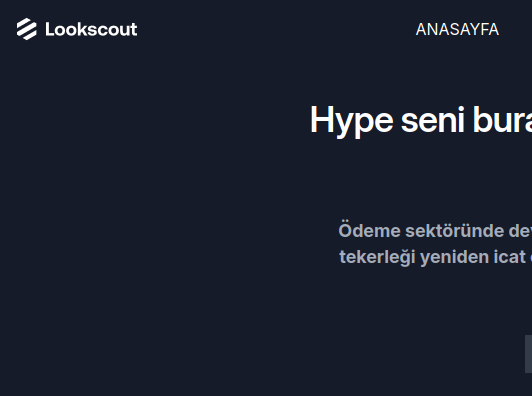

# TR
# Lookscout — Web Uygulaması Açılış Sayfası
Lookscout markası için tasarlanmış, saf HTML ve CSS kullanılarak geliştirilmiş tam duyarlı bir kurumsal açılış sayfası. Navigasyon, özellik kartları, blog yazıları, müşteri yorumu ve footer gibi tüm temel bölümleri kapsar.

## Canlı Önizleme

[Projeyi deploy edildikten sonra canlı önizlemesi.](https://dursunkokturk.github.io/Front-End-School-Responsive-Project-Lookscout-Pricing-Page/)

## Özellikler

- Duyarlı Navigasyon — Mobil/tablette hamburger menü, masaüstünde tam menü çubuğu
- Hero Bölümü — Destekçi marka logolarıyla birlikte CTA ve açıklayıcı metin
- 6 Özellik Kartı — İkon, başlık ve bağlantıyla iş organizasyonu, analitik, entegrasyon gibi başlıklar
- Koşullu Görsel — Masaüstünde farklı, mobil/tablette farklı klavye görseli (CSS active / not-active sınıfları ile)
- Karanlık Bölümler — #151B28 arka planlı özellikler ve footer alanları
- Blog Kartları — Mobilde 1, tablette 2, masaüstünde 3 sütunlu ızgara; üçüncü kart mobilden gizlenir
- Müşteri Yorumu — Avatar, isim ve unvanla birlikte alıntı bölümü
- E-posta Abonelik Formu — Güvenlik, destek ve anlaşma onay ikonlarıyla birlikte
- Footer — Kaynaklar ve Ürünler bağlantıları, e-posta girişi ve sosyal medya ikonları
- Saf HTML & CSS — JavaScript veya harici kütüphane kullanılmaz

## Duyarlı Düzenler

| Ekran    | Genişlik         | Öne Çıkan Değişiklikler                             |
| -------- |------------------| ----------------------------------------------------|
| Mobil    | 375px Varsayılan | Tek sütun, Hamburger menü                           |
| Tablet   | > 767px          | 2 sütunlu grid, Gizli üçüncü blog kartı             |
| Masaüstü | > 1109px         | 3 sütunlu grid, tam navbar, koşullu görsel değişimi |

## Teknolojiler

| Teknoloji    | Açıklama                                   |
| ------------ |--------------------------------------------|
| HTML5        | Semantik sayfa yapısı                      |
| CSS3         | Grid, Flexbox, @media sorguları            |
| Google Fonts | Inter yazı ailesi                          |

## Proje Yapısı
lookscout/  
├── index.html  
└── assets/  
    ├── css/  
    │   └── lookscout.css  
    └── img/  
        ├── avatars/  
        │   ├── avatar.png  
        │   ├── avatar-man.png  
        │   └── avatar-woman.png  
        ├── icons/  
        │   ├── icon-organization.png  
        │   ├── icon-process.png  
        │   ├── icon-analize.png  
        │   ├── icon-connection.png  
        │   ├── icon-integration.png  
        │   ├── icon-workflow.png  
        │   ├── icon-explere.png  
        │   ├── icon-bulb.png  
        │   ├── icon-ship.png  
        │   ├── icon-check.png  
        │   └── icon-right.png  
        ├── logos/  
        │   ├── logo-company.png  
        │   ├── logo-company-dark.png  
        │   ├── logo-gitlab.png  
        │   ├── logo-slack.png  
        │   ├── logo-slack-black.png  
        │   ├── logo-netflix.png  
        │   ├── logo-paypal.png  
        │   ├── logo-paypal-blue.png  
        │   ├── logo-verge.png  
        │   ├── logo-google.png  
        │   ├── logo-google-letter.png  
        │   ├── logo-pinterest.png  
        │   ├── logo-mailchimp.png  
        │   ├── logo-facebook.png  
        │   ├── logo-apple.png  
        │   └── logo-instagram.png  
        ├── wall.png  
        ├── wall-computer.png  
        ├── photo-grass.png  
        ├── photo-radiator.png  
        ├── photo-desk-chair.png  
        ├── burger-menu.png  
        └── chevron-down.png  

## Kurulum
Proje herhangi bir bağımlılık gerektirmez. Klonladıktan sonra doğrudan tarayıcıda açabilirsiniz.
bash# Repoyu klonlayın
git clone https://github.com/dursunkokturk/Front-End-School-Responsive-Project-Lookscout-Pricing-Page.git

### Proje klasörüne girin
cd Front-End-School-Responsive-Project-Lookscout-Pricing-Page

### index.html dosyasını tarayıcıda açın
Proje klasörü içinde çift tıklayarak yada  
Projeyi VSCode içinde açıp index.html dosyasının üzerinde sağ tıkladıktan sonra "Open With Live Server" tıklayarak projeyi browser'da açıyoruz.

## Tasarım Detayları

- Renk Paleti:
    - #2663FD — Ana mavi (navbar, hero arka planı)
    - #437EF7 — Açık mavi (butonlar, bağlantılar)
    - #151B28 — Koyu lacivert (karanlık bölümler, footer)
    - #5F6D7E — Gri (gövde metni)
    - #A5ACBA — Açık gri (karanlık arka plan metinleri)

- Font: Inter

# EN
# Lookscout — Web App Landing Page
A fully responsive corporate landing page designed for the Lookscout brand, built with pure HTML and CSS. Covers all essential sections including navigation, feature cards, blog posts, customer testimonial, and footer.

## Live Preview
Live preview after the project is deployed.

## Features

- Responsive Navigation — Hamburger menu on mobile/tablet, full menu bar on desktop
- Hero Section — CTA and descriptive text alongside supporter brand logos
- 6 Feature Cards — Topics like business organization, analytics, integrations with icon, title, and link
- Conditional Image — Different keyboard visuals for desktop vs mobile/tablet (via CSS active / not-active classes)
- Dark Sections — Features and footer areas with #151B28 background
- Blog Cards — 1-column on mobile, 2-column on tablet, 3-column on desktop grid; third card hidden on mobile
- Customer Testimonial — Quote section with avatar, name, and title
- Email Subscription Form — With security, support, and agreement confirmation icons
- Footer — Resources and Products links, email input, and social media icons
- Pure HTML & CSS — No JavaScript or external libraries used

## Responsive Layouts

| Screen   | Width         | Notable Changes                                    |
| -------- |---------------| ---------------------------------------------------|
| Mobile   | 375px Default | Single column, Hamburger menu                      |
| Tablet   | > 767px       | 2-column grid, third blog card hidden              |
| Masaüstü | > 1109px      | 3-column grid, full navbar, conditional image swap |

## Technologies

| Technology   | Description                   |
| ------------ |-------------------------------|
| HTML5        | Semantic page structure       |
| CSS3         | Grid, Flexbox, @media queries |
| Google Fonts | Inter font family             |

## Project Structure
lookscout/  
├── index.html  
└── assets/  
    ├── css/  
    │   └── lookscout.css  
    └── img/  
        ├── avatars/  
        │   ├── avatar.png  
        │   ├── avatar-man.png  
        │   └── avatar-woman.png  
        ├── icons/  
        │   ├── icon-organization.png  
        │   ├── icon-process.png  
        │   ├── icon-analize.png  
        │   ├── icon-connection.png  
        │   ├── icon-integration.png  
        │   ├── icon-workflow.png  
        │   ├── icon-explere.png  
        │   ├── icon-bulb.png  
        │   ├── icon-ship.png  
        │   ├── icon-check.png  
        │   └── icon-right.png  
        ├── logos/  
        │   └── ...  
        ├── wall.png  
        ├── wall-computer.png  
        ├── photo-grass.png  
        ├── photo-radiator.png  
        ├── photo-desk-chair.png  
        ├── burger-menu.png  
        └── chevron-down.png  

## Installation
The project requires no dependencies. After cloning, you can open it directly in the browser.  
bash# Clone the repo  
git clone https://github.com/dursunkokturk/Front-End-School-Responsive-Project-Lookscout-Pricing-Page.git

### Navigate to the project folder
cd Front-End-School-Responsive-Project-Lookscout-Pricing-Page

### Open index.html in the browser
Open it by double-clicking inside the project folder, or  
open the project in VSCode, right-click on the index.html file, and select "Open With Live Server" to launch it in the browser.

## Design Details

- Color Palette:
    - #2663FD — Primary blue (navbar, hero background)
    - #437EF7 — Light blue (buttons, links)
    - #151B28 — Dark navy (dark sections, footer)
    - #5F6D7E — Gray (body text)
    - #A5ACBA — Light gray (text on dark backgrounds)

- Font: Inter
